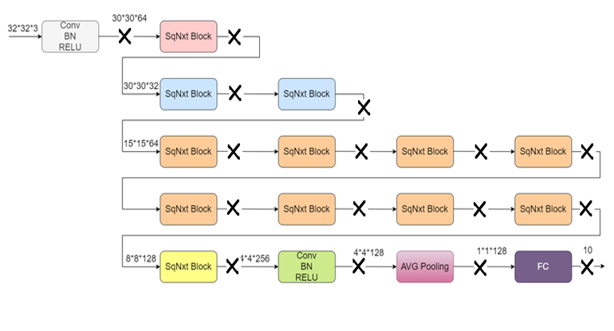

# ML-hardware-acceleration-network-SqueezNext

The target in this project is to open the possibility of implementing any CNN architecture on FPGA and ASIC, and focusing in accelerating the design and lowering power. squeezenext is the chosen architecture due to its high accuracy and its low number of parameters which is much less than other CNN architectures, which leadsto the reduction in the number of resources needed to be implemented.

# 14-Layer pipelined main idea

Achevied Accuracy of 90.96% and throughput of 9254.975 image/second and energy of 1.826 mJ at 100Mhz in virtex-7 VC709 fpga
